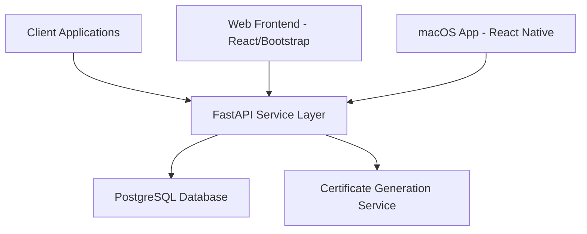
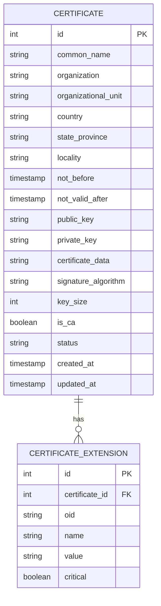
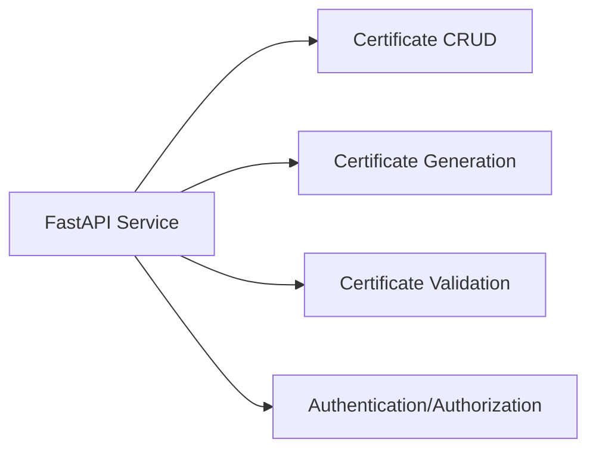
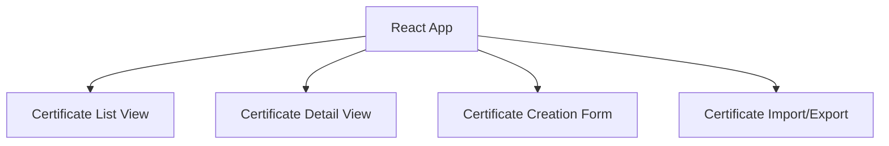
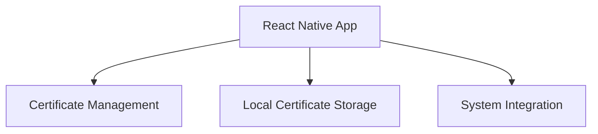

# Certificate Management System - Detailed Architecture Plan

## 1. System Overview

We'll build a comprehensive certificate management system with the following components:



## 2. Component Details

### 2.1 Database Layer (PostgreSQL)

The PostgreSQL database will store all certificate-related information with the following schema:



### 2.2 Service Layer (FastAPI)

The FastAPI service will provide RESTful endpoints for certificate management:



Key API endpoints:
- `GET /certificates` - List all certificates
- `GET /certificates/{id}` - Get certificate details
- `POST /certificates` - Create new certificate
- `PUT /certificates/{id}` - Update certificate
- `DELETE /certificates/{id}` - Delete certificate
- `POST /certificates/generate` - Generate certificate from CSR
- `GET /certificates/validate/{id}` - Validate certificate

### 2.3 Web Frontend (React + Bootstrap)

The React web application will provide a user-friendly interface for certificate management:



### 2.4 macOS Application (React Native)

The React Native application will provide similar functionality to the web frontend but optimized for macOS:



## 3. Implementation Plan

### 3.1 Phase 1: Backend Development

1. Set up project structure
2. Configure PostgreSQL database
3. Implement database models
4. Create FastAPI CRUD endpoints
5. Implement certificate generation service
6. Add authentication and authorization

### 3.2 Phase 2: Frontend Development

1. Set up React project structure
2. Implement certificate list and detail views
3. Create certificate management forms
4. Add import/export functionality
5. Implement authentication UI

### 3.3 Phase 3: macOS Application

1. Set up React Native project
2. Implement certificate management UI
3. Add local storage functionality
4. Integrate with system certificate store

### 3.4 Phase 4: Testing and Deployment

1. Write unit and integration tests
2. Set up CI/CD pipeline
3. Deploy backend services
4. Deploy web frontend
5. Package macOS application

## 4. Project Structure

```
certificate-management-system/
├── backend/
│   ├── app/
│   │   ├── api/
│   │   │   ├── __init__.py
│   │   │   ├── certificates.py
│   │   │   └── auth.py
│   │   ├── core/
│   │   │   ├── __init__.py
│   │   │   ├── config.py
│   │   │   └── security.py
│   │   ├── db/
│   │   │   ├── __init__.py
│   │   │   ├── base.py
│   │   │   └── session.py
│   │   ├── models/
│   │   │   ├── __init__.py
│   │   │   └── certificate.py
│   │   ├── schemas/
│   │   │   ├── __init__.py
│   │   │   └── certificate.py
│   │   ├── services/
│   │   │   ├── __init__.py
│   │   │   └── certificate_service.py
│   │   └── main.py
│   ├── alembic/
│   │   └── versions/
│   ├── tests/
│   │   ├── __init__.py
│   │   └── test_certificates.py
│   ├── .env
│   ├── requirements.txt
│   └── alembic.ini
├── web-frontend/
│   ├── public/
│   ├── src/
│   │   ├── components/
│   │   ├── pages/
│   │   ├── services/
│   │   ├── utils/
│   │   ├── App.js
│   │   └── index.js
│   ├── package.json
│   └── README.md
└── macos-app/
    ├── src/
    │   ├── components/
    │   ├── screens/
    │   ├── services/
    │   ├── utils/
    │   └── App.js
    ├── package.json
    └── README.md
```

## 5. Technology Stack

- **Backend**:
  - Python 3.9+
  - FastAPI
  - SQLAlchemy
  - Alembic (migrations)
  - Pydantic
  - PyOpenSSL
  - asyncpg
  - pytest

- **Database**:
  - PostgreSQL 13+

- **Web Frontend**:
  - React 18
  - Bootstrap 5
  - Axios
  - React Router
  - Redux Toolkit

- **macOS Application**:
  - React Native
  - React Native macOS
  - AsyncStorage
  - React Navigation

## 6. Security Considerations

1. Secure storage of private keys
2. Role-based access control
3. API authentication using JWT
4. HTTPS for all communications
5. Input validation and sanitization
6. Audit logging for all certificate operations

## 7. Deployment Strategy

1. Backend: Docker containers orchestrated with Kubernetes
2. Database: Managed PostgreSQL service
3. Web Frontend: Static hosting with CDN
4. macOS App: Distribution through App Store or direct download